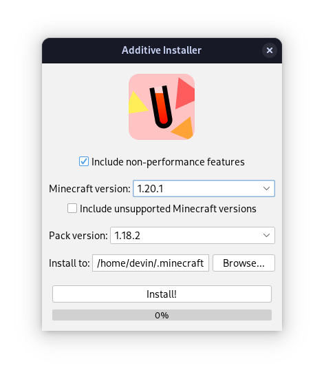
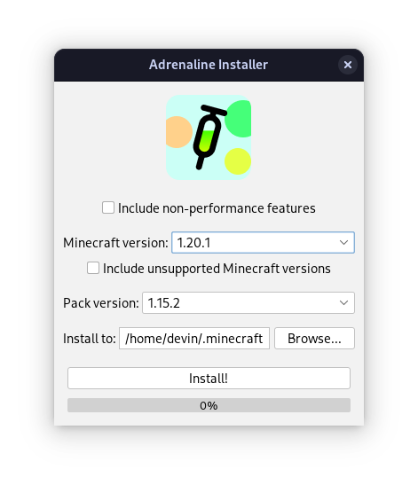

<!--suppress HtmlDeprecatedAttribute -->

  
   
   
  

    Standalone installer for the <a href="https://github.com/intergrav/Additive">Additive</a> and <a href="https://github.com/intergrav/Adrenaline">Adrenaline</a> Minecraft modpacks
     
    <a href="https://github.com/Gaming32/additive-installer/issues">Report Bugs</a>
    ·
    <a href="https://github.com/Gaming32/additive-installer/issues">Request Features</a>
  

Devin's modpacks, [Additive](https://github.com/intergrav/Additive) and [Adrenaline](https://github.com/intergrav/Adrenaline), require you to use a third-party launcher to install and run them, which can be a bit of a hassle for some users. This program aims to solve this issue by allowing you to easily install either modpack onto the default Minecraft launcher, without requiring any third-party tools. 

Head over to the [releases](https://github.com/Gaming32/additive-installer/releases) page to download and run the installer. `jar` files are provided for all operating systems, and `exe` files are alternatively provided - Windows only.

## Preview

  
  

